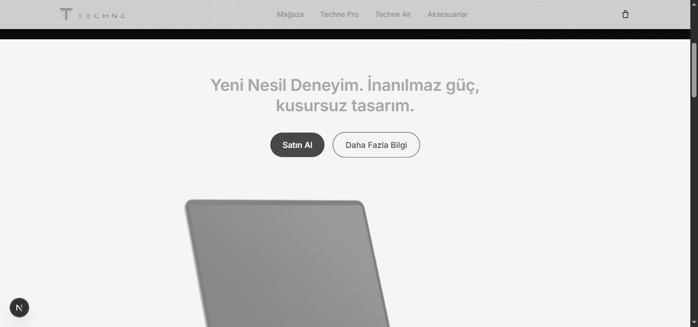
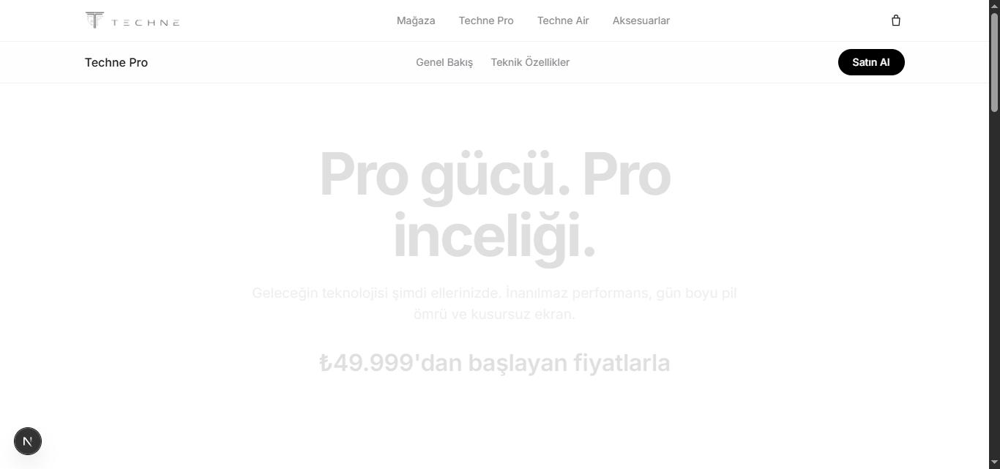

# TECHNE

A premium consumer-electronics storefront built to explore Apple-style product marketing pages in Next.js — scroll-driven storytelling, a token-based design system, and a real (client-side) cart, rather than a generic CRUD shop template.


<p align="center">
  
  
</p>

## Overview

TECHNE is a fictional consumer-electronics brand (laptop, tablet, earbuds, watch, power bank) built as a front-end showcase. The goal was to reproduce the feel of a high-end product page — restrained typography, generous whitespace, and animation that reinforces the content instead of decorating it — while keeping the implementation clean enough to actually maintain.

Content is in Turkish; the codebase, structure, and this README are in English.

## Features

- **Scroll-driven storytelling** — reusable `Reveal` and `Parallax` primitives (`src/components/motion/`) wrap GSAP + `ScrollTrigger` behind a small declarative API (`<Reveal y={28} stagger={0.08}>`), so sections fade/slide/stagger into view once, respect `prefers-reduced-motion` via `gsap.matchMedia()`, and clean up their own triggers.
- **App Router product catalog** — dynamic product routes (`src/app/product/[slug]`) render from a single typed data source (`src/lib/products.ts`), each with its own hero, spec table, and highlight grid.
- **Persistent cart** — a `useReducer`-backed `CartContext` (`src/lib/cart-context.tsx`) handles add/update/remove/clear and syncs to `localStorage`, with a hydration guard so the SSR'd page never flashes stale client state.
- **Token-driven design system** — colors, type scale, spacing, and elevation are defined once (see `DESIGN.md`, "Aura Precision") and consumed as Tailwind v4 CSS variables, keeping the UI visually consistent without magic numbers scattered through components.
- **Fully responsive**, keyboard-accessible interactive elements (storage/variant pickers, quantity steppers, mobile nav).

## Tech stack

- [Next.js 16](https://nextjs.org/) (App Router, Turbopack)
- [React 19](https://react.dev/)
- [TypeScript](https://www.typescriptlang.org/)
- [Tailwind CSS v4](https://tailwindcss.com/)
- [GSAP](https://gsap.com/) + `@gsap/react` (`useGSAP`) for scroll animation
- ESLint (`eslint-config-next`)

## Getting started

```bash
git clone https://github.com/<your-username>/techne-ecommerce.git
cd techne-ecommerce
npm install
npm run dev
```

Open [http://localhost:3000](http://localhost:3000).

Other scripts: `npm run build`, `npm start`, `npm run lint`.

## Project structure

```
src/
├─ app/
│  ├─ page.tsx                 # Home — hero + product grid
│  ├─ product/[slug]/page.tsx  # Dynamic product detail page
│  ├─ cart/page.tsx            # Cart
│  └─ layout.tsx
├─ components/
│  ├─ motion/                  # Reveal / Parallax GSAP primitives
│  ├─ Navbar.tsx, Footer.tsx, Button.tsx
│  ├─ ProductCard.tsx, ProductDetail.tsx, HighlightIcon.tsx
│  └─ ui/fluid-flow-grid.tsx
└─ lib/
   ├─ products.ts               # Typed product catalog (static data)
   ├─ cart-context.tsx          # Cart state (Context + useReducer + localStorage)
   └─ gsap.ts                   # GSAP/ScrollTrigger registration
```

## License

MIT — see [LICENSE](LICENSE).
